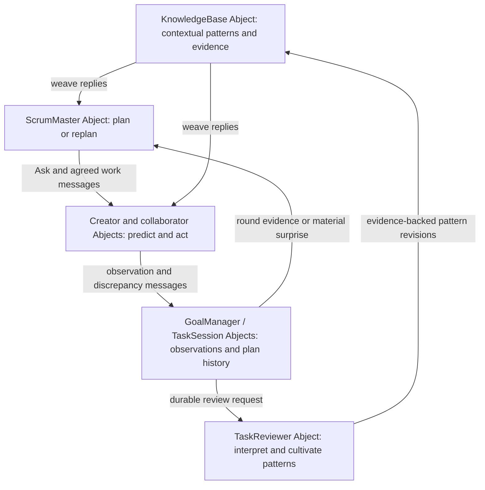
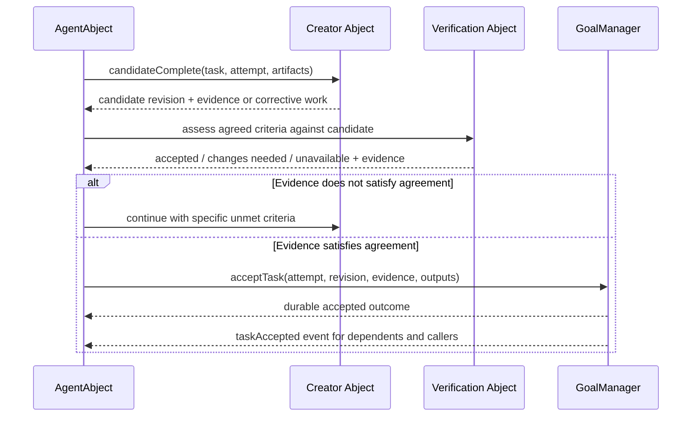

**Abject agent system: learning through Scrum, predictions, and patterns**

Review date: September 7, 2026. Base commit: `4489f50`, including the existing uncommitted working tree. Status at review time: proposed implementation plan. Implementation now exists in the uncommitted working tree; see [implementation and testing notes](AGENT_SYSTEM_IMPLEMENTATION_2026-09-08.md) for changes, checks, and remaining empirical validation. This plan supersedes conflicting claims in older review documents, particularly claims that gates are authoritative, that delegation is absent, or that the existing design already outperforms other products.

**Scope update:** The user subsequently requested removal of separate-process JavaScript isolation and restoration of the previous in-process `vm` execution. That request supersedes this plan's proposed JavaScript execution boundary; the other agent-system improvements remain in scope.

**The objective is a learning agent system, expressed through two excellent creator experiences.** ObjectCreator should turn intent into a working, inspectable, persistent application that can evolve while running. ExternalCreator should complete real repository work with trustworthy edits, useful verification, fast interaction, and recovery across interruptions. Scrum is the organizing cycle: plan from current understanding, predict, act, observe what actually happened, and replan. Experience changes the pattern language, and that language improves subsequent plans. Applications, agents, integrations, and project services teach one another through Ask and collaborate through messages.

This revision makes that cycle foundational. The earlier emphasis on acceptance and recovery remains necessary: misleading outcomes corrupt learning. But accurate outcomes must improve the next decision, the next scrum, and the next related goal. Learning here means revising explicit knowledge, patterns, and strategies through experience; the inspected implementation does not train model weights.

Feature counts will not establish superiority over pi, OpenCode, or Claude Code. Reliable completion, adaptation to surprises, improvement across related goals, interaction latency, cost per accepted task, and how much supervision users need will.

**Architectural rules apply to every milestone.**

1. Every stateful component introduced here is an Abject. Its state belongs to it and is accessed through messages. There is no parallel agent framework, central tool-dispatch singleton, or privileged verifier calling another object's internals.
2. Ask is how collaborators discover capabilities, explain constraints, negotiate work, and recover from surprises. Natural-language dialogue remains useful; a universal rigid capability taxonomy is not required.
3. Ask-derived agreements make subsequent calls predictable. Agreed methods, operation IDs, version references, and result semantics travel in ordinary messages. Familiar deterministic operations do not need a model call every time.
4. Receivers enforce their own state transitions and grants. An Ask response, model-generated plan, or caller-supplied identity is not authorization.
5. Model reasoning chooses strategies, explores alternatives, and proposes completion. Evidence and receiver-owned state establish what actually happened.
6. Existing objects grow new protocols first. New Abjects are introduced when they own a distinct lifecycle or resource. Pure parsing and graph algorithms may remain internal implementation helpers; they do not become shared mutable authorities.
7. Async message handlers can overlap today. Correctness must use revisions, operation identities, and atomic receiver-side updates; merely saying an object owns a mailbox is insufficient.
8. A plan is a revisable proposal based on explicit beliefs. Scrums consume observations and prediction discrepancies, reconsider pattern applicability, and record why the plan changed or stayed the same. Failed experiments and rejected candidates are learning material too.
9. Patterns retain Context, Forces, Therefore, consequences, evidence, and links. They guide judgment and composition; their applicability must be reconsidered as context changes. Executable skills are a separate form of reuse.

**The existing learning system provides the foundation.**

| Layer | What the code already does | Why it matters |
|---|---|---|
| Action prediction | AgentAbject accepts an optional `expect` on actions, pairs it with the result, shows the comparison in the conversation, and retains a per-task prediction ledger. | An agent can correct its working belief during execution, before the goal ends. |
| Scrum planning and replanning | ScrumMaster receives goal state, completed/failed tasks, scratchpad, user steering, and the team roster. `review_scrum` recalls knowledge and calls KnowledgeBase `weave`; round completion returns control to planning. | Planning already incorporates execution feedback and prior experience. It is not limited to producing the initial task graph. |
| Pattern language | Structured patterns contain Context, Forces, Therefore, Evidence, optional Contract/Program/Resulting context/Consequences, and named links. `weave` retrieves lexical matches and expands through linked patterns. Both ScrumMaster and executing agents receive woven patterns. | Context and tensions guide decomposition; resulting contexts and links suggest what becomes appropriate next. |
| Retrospective learning | TaskReviewer reviews goal-bound tasks when the goal completes **or fails**, examines prediction ledgers and injected knowledge, and may record lessons or refine patterns. Standalone tasks use a review cadence. | The implementation already recognizes that failed goals teach and that an individual task's apparent success may lead nowhere. |
| Pattern cultivation | Reviewer guidance says a first occurrence becomes a `candidate-pattern` lesson; recurring shapes may become patterns. Existing patterns should be refined, linked, and curated. `markUseful` records reviewer feedback. | The intended memory is a growing, connected language whose claims improve with experience. |

Sources: [action predictions](../src/objects/agent-abject.ts#L4185), [Scrum observation and weaving](../src/objects/scrum-master.ts#L1103), [pattern structure](../src/core/pattern.ts#L35), [weave implementation](../src/objects/knowledge-base.ts#L988), [review triggers](../src/objects/task-reviewer.ts#L229), and [pattern cultivation instructions](../src/objects/task-reviewer.ts#L943).

Keep the structured pattern storage and migration already present. Its comments describe an earlier prose-parsing bug that flattened sections and hid links; the current structure addresses that problem. Do not report it as an unfixed defect or replace structured storage with generated prose.

**The learning loop has specific gaps that deserve early fixes.** These findings come from implementation tracing, separate from the eighteen reproduced diagnostics below. The ordering and overload cases need controlled message-path tests before their runtime frequency can be claimed.

| Gap | Evidence and consequence | Planned correction |
|---|---|---|
| Action failure is treated as a proven prediction miss | `recordPrediction` sets `missed:true` for every failed action; the result prompt and reviewer repeat that judgment. An experiment predicting rejection can therefore be labelled wrong when its prediction held. Successful transport/domain-error confusion also contaminates this signal. | Separate operation outcome from prediction assessment: supported, contradicted, or unresolved. Preserve expected negative outcomes. Use mechanical checks for testable predicates and evidence-backed interpretation for free text. |
| Scrum lacks a first-class account of changed beliefs | `review_scrum` exposes outcomes and scratchpad but does not explicitly aggregate the agents' prediction ledgers, disputed assumptions, or the reasons for successive plan revisions. Its automatic weave query remains the original goal description. | Persist round decisions and compact observation/delta records. Weave again using the current context, discovered constraints, and unresolved questions when those change. |
| The retrospective can miss its execution record | `commitCompleteGoal` sends `completeGoal` before writing `scrum/plan`, while TaskReviewer starts on `goalCompleted`. Failed and quick-completion paths do not call that record writer. | Persist a round/terminal evidence record before emitting review-ready work; reference its revision in the review request. Cover success, failure, cancellation/partial outcomes, and the quick path. |
| Reviews can omit the decisive recovery | Goal review selects the oldest six retained terminal tasks and releases every task for the goal after review, including unselected tasks. Caps and a five-item pending queue can leave goals without a scheduled review. | Retain compact evidence for every round; prioritize surprising observations, failed approaches, recovery, and final checks when selecting transcripts. Persist pending review work with visible deferral and resumable cursors. Budget limits defer expensive interpretation without silently discarding the evidence. |
| Evidence is easily overstated | Prediction results are truncated to 400 characters, and reviewer display to 300; pattern Evidence is free text. Recurrence before promotion is prompt guidance: `savePattern` permits a default of `forming (1 goal)`. | Preserve full observation artifacts behind message-addressable references. Attach provenance and distinct supporting/contradicting episodes to pattern revisions. Label candidates explicitly and prevent unsupported claims of repeated success. |
| Retrieval and usefulness are only partially connected | `weave` ranks a pool of 100 entries across all types, then filters for patterns; unrelated high-ranking entries can crowd patterns out. `markUseful` raises a counter used for retention; `rankIds` uses lexical rank, without outcome-sensitive pattern ranking. Links resolve by current normalized title, not aliases. | Search active patterns before applying the pool cap; retain link expansion and expose why each entry was selected. Add stable link identity/alias resolution. Evaluate context-sensitive ranking with positive and negative application evidence, without treating popularity as truth. |
| Following a pattern is confused with benefiting from it | Review guidance credits entries visibly relied upon; another instruction assumes failure after following a pattern means incomplete Forces. An unrelated provider outage need not refute a design pattern. | Distinguish retrieved, considered, applied, helpful, harmful, and inconclusive. Record a causal explanation and competing causes. Revise context/forces when evidence warrants it; keep transient availability separate from durable design knowledge. |
| The normal shortcut omits a return to Scrum review | Quick dispatch can finish directly after a grounded-looking successful result; failures or pending user steering return to Scrum. Goal-terminal TaskReviewer learning still applies, subject to its limits. | Model simple work as a lightweight one-task scrum with the same evidence and learning record. A deterministic closing check can avoid an extra model call; a material surprise triggers replanning. |

Sources: [prediction classification and prompts](../src/objects/agent-abject.ts#L4196), [review selection and retention](../src/objects/task-reviewer.ts#L399), [completion record ordering](../src/objects/scrum-master.ts#L1468), [failure path](../src/objects/scrum-master.ts#L1664), [quick completion](../src/objects/scrum-master.ts#L1865), [pattern creation](../src/objects/task-reviewer.ts#L734), [lexical ranking](../src/objects/knowledge-base.ts#L754), [usefulness updates](../src/objects/knowledge-base.ts#L1170), and [link resolution](../src/objects/knowledge-base.ts#L1270).

**Strengthen three connected learning cycles.**

Every edge denotes message passing. Initially extend GoalManager's owned goal/round state and AgentAbject's existing ledger. TaskSession remains the later lifecycle extraction described below. Do not add another planner or learning coordinator with competing authority.

1. **Within an action sequence: update the working belief.** Encourage a falsifiable prediction for consequential changes, uncertain calls, diagnostic experiments, and acceptance checks; do not require boilerplate predictions for every trivial read. Record the expectation before execution. Associate observations with task, attempt, operation, relevant object/project revision, and full evidence references. Missing evidence means unresolved. The next decision states what changed in the working belief and chooses a check or action that distinguishes plausible explanations. Free-text predictions remain supported; optional structured predicates make common checks cheaper.
2. **Within a goal: replan from changed understanding.** Each scrum records the intended outcome, important assumptions, selected pattern revisions and why they fit, task dependencies, expected observations, and conditions for reconsideration. At the next review, compare prediction with observation and record a plan delta: what stays, what changes, why, and what uncertainty the next batch resolves. A small experiment may be more useful than another implementation attempt. Agents can report a material discrepancy or newly discovered capability through messages while work is running. ScrumMaster coalesces these signals, asks affected collaborators for interpretation, and revises the affected work; it need not restart unaffected work or call a meeting for every error. GoalManager applies a revision-checked plan change so old queued work cannot launch against a superseded plan. Already-running work must reach a safe stop or finish with its effects reconciled before conflicting replacement work starts.
3. **Across goals: improve the language that generates plans.** TaskReviewer receives compact evidence from every round plus representative action records and terminal outcome evidence. Within-goal lessons immediately influence that goal's next scrum; they do not wait for global promotion. The reviewer can be asked for bounded analysis during a long goal when useful, while durable pattern cultivation normally follows retrospective review. Preserve its designated pattern-curation role and KnowledgeBase's storage ownership. A tentative lesson becomes a contextual candidate; independent recurrence can justify promotion, while counterexamples can narrow, split, or retire a pattern. Preserve user-authored knowledge and make automatic revisions inspectable and reversible.

ScrumMaster uses Ask as an inquiry into the current situation: “This plan assumed X; observation Y contradicts it. Does pattern P still apply? What has changed in your capabilities or constraints? Which small experiment would distinguish A from B? What work can you now take on?” ObjectCreator can ask an existing application how its live state behaves; ExternalCreator can ask project and test services how a new diagnostic changes its approach. Capability claims and remembered patterns remain hypotheses until relevant observations support them.

**Pattern evolution must preserve context and uncertainty.** Keep the current human-readable anatomy. Add application/evidence records referencing pattern ID and revision, goal/round/attempt, observed context, predicted effect, actual observations, verdict, and competing explanations. These records live behind KnowledgeBase/goal/session message interfaces; they are not another global in-memory registry. Keep useful prose Evidence, but derive recurrence counts from distinct episodes rather than letting an LLM invent “proven in 3 goals.” One exceptional observation can warrant an explicitly tentative candidate without masquerading as recurrence.

Store revisions and apply reviewer edits with an expected-base version so concurrent curation or peer updates cannot silently erase a counterexample. Use evidence identities to deduplicate replayed feedback; repeated `markUseful` delivery must not multiply apparent support. Offer structured summaries preserving Context, Forces, Therefore, limitations, and evidence instead of cutting every pattern at a raw 3,000-character boundary. Fetch full sections through Ask-discovered methods when needed. Follow links when their resulting contexts become relevant; do not assume every linked pattern applies immediately.

Automating a stable procedure into a skill or deterministic Abject is useful after evaluation, but keep its applicability conditions and a path back to Scrum when observations diverge. The system should learn both when a familiar approach works and when to leave it behind.

For example, ObjectCreator may predict that a new settings object retains its values after restoration. A failed restoration is evidence about that lifecycle, even if deployment succeeded. The next scrum can ask the object and storage collaborators for their contracts, add a focused restoration experiment, and revise the implementation sequence. ExternalCreator may predict that a public type change affects only one package; diagnostics in an untouched consumer contradict that assumption. The next scrum expands investigation and verification scope. If comparable episodes reveal a recurring design tension, TaskReviewer can refine a pattern's Context, Forces, Contract, and links. Neither lesson depends on pretending the original task succeeded.

**Evidence collected for this plan.** The agent implementations, shared runtime, goal coordination, live source updates, project/file/shell capabilities, permission state, Ask handling, and prior design documents were inspected. Eighteen focused diagnostic tests exercised current implementations with stubbed collaborators. They assert the current undesirable behavior, so their passing means the defects were reproduced, not fixed. They are not end-to-end model evaluations or a full security audit.

Reproduction script for this session: `/tmp/abject-agent-deep-dive.probes.mts`; results: `/tmp/abject-agent-deep-dive.probes.log`. The stubs simulate responses and interleavings without modifying user projects or calling a live model. Existing tests: 78 passed, one live CLI test skipped in the sandbox, zero failures. Type checking reports eight TS18048 errors in `external-project-browser.ts` involving optional `sharedPaths`/`protectedPaths`. Logs: `/tmp/abject-agent-deep-dive.baseline-tests.log` and `/tmp/abject-agent-deep-dive.typecheck.log`.

**The reproduced defects are concrete starting points.** Priorities: P0 risks incorrect completion, lost work, or task isolation; P1 causes bad decisions, stalled work, or unnecessary cost. File links below identify the owning implementation; probe IDs identify the exact diagnostic case.

| ID | Priority | Current behavior and consequence | Required correction |
|---|---|---|---|
| E1 | P0 | `opVerify(full:false)` resets `mutationsSinceVerify`, and the completion gate accepts the fast check despite a distinct full verification command. An older passing full result can also remain preferred. | Bind evidence to command identity, required verification level, and exact candidate revision. A fast check satisfies full verification only when explicitly agreed equivalent. |
| E2 | P0 | On a failing baseline, `judge` can accept new diagnostics in files not edited by this task. Changing an exported API can break an untouched consumer; no concurrent task is needed for the error to be attributed away. | Diagnostic location is not causal attribution. Unexplained new failures remain unresolved; use isolated before/after candidates or actual concurrent-change evidence. |
| E3 | P0 | `opBash` records output but does not track resulting file changes or invalidate verification. The same concern applies to generic calls that mutate a project. | Project-owned change tracking reconciles every effectful operation, including shell, tools, generators, deletes, and external edits. Unknown effects invalidate evidence until reconciled. |
| E4 | P0 | Rollback proceeds when a pre-image exists but a post-image is missing, contrary to the comment promising rollback is disabled in that case. | Missing provenance must prevent destructive restoration. |
| E5 | P0 | Rollback checks current contents with one message and writes with another. A concurrent change between them is overwritten. | HostFileSystem must support conditional replace/restore as one receiver-side mutation using the expected content revision. |
| E6 | P1 | First-touch nested instructions are returned after `write`/`edit` has already changed the file. | Resolve and present applicable instructions before authoring the first mutation in a new scope, with version-aware caching. |
| E7 | P0 | `set_project` changes project/root but retains old modified files and verification state; it does not rebuild the root instruction block. | Explicit project-session transition: finish or suspend old scope, establish new context, and maintain distinct change/evidence records. |
| O1 | P0 | An `input` call to an unrelated object counts as exercising the deployed target. A returned `{success:false}` still counts if the message round trip succeeds. | Behavioral evidence must identify the target/deployment and actual agreed outcome. UI inputs must be linked to the target's owned UI. |
| O2 | P0 | One goal-wide saved-draft key can feed an Object A draft into an Object B task addressed by UUID, because the guard compares optional names. Parallel tasks also overwrite or clear the same slot. | Drafts have distinct identities, owner task, durable target, base revision, and explicit handoff; no automatic adoption based only on a shared goal. |
| R1 | P0 | Invalid `responseSchema` throws in finalization before any ticket result is sent. The outer runner still marks the entry finished and releases its slot. | Validate schemas at admission; every teardown path must durably settle and deliver an explicit outcome. |
| R2 | P0 | Repeated `startTask` with the same ID launches twice while replacing the map entry. | Task admission is idempotent at the receiver; conflicting duplicate requests are rejected. Distinguish task identity from attempt identity. |
| R3 | P0 | Stale setup is failed and its slot reclaimed, but no cancellation fence is recorded; its delayed setup may subsequently start the task. | A durable attempt generation fences late starts and late results. Setup has explicit status and correlated activity. |
| R4 | P1 | Loop signatures omit file path and command, so reads of different files and different shell commands collapse to the same signature. | Include operation subject and relevant arguments; distinguish repeated observations from actual lack of state/evidence progress. |
| S1 | P1 | `add_task` accepts `canExecute:false` agents such as AgentCreator even though normal roster guidance excludes them. | Explicitly distinguish executable admission from advisory participation. Validate assignment at commit and receiver admission. |
| S2 | P1 | Default `poll_team` ignores its goal argument, asks about “this goal” without supplying it, and caches identical questions across goals. | Always include intent/revision/constraints and key relevance caches by actual task context plus capability revision. |
| A1 | P0 | A standalone ObjectAgent task can use `_currentGoalId` belonging to another active task and write its scratchpad. The fallback pattern also exists in SkillAgent and WebAgent. | Remove shared goal fallbacks. Every operation derives its scope from its own task context; absent context stays absent. |
| A2 | P1 | ObjectAgent wraps an application-level rejection as a successful action. | Learn result semantics through Ask and preserve execution outcome separately from transport success. |
| A3 | P1 | SkillAgent wraps MCP `isError:true` as successful text. | Preserve the MCP error indicator in the action result so retries, batching, and progress accounting see the failure. |

Sources: [ExternalCreator](../src/objects/external-creator.ts), [ObjectCreator](../src/objects/object-creator.ts), [AgentAbject](../src/objects/agent-abject.ts), [ScrumMaster](../src/objects/scrum-master.ts), [ObjectAgent](../src/objects/object-agent.ts), [SkillAgent](../src/objects/skill-agent.ts).

**Additional findings from implementation tracing need integration tests.**

- **Completion ordering corrupts coordination and learning.** AgentAbject calls GoalManager.completeTask before the specialists apply their final gates. Dependent tasks can start before a creator rejects its completion claim, and retrospective learning can receive misleading outcomes. The quick-dispatch path can finish the whole goal on the same premature success. Result schemas and missing declared outputs are currently advisory. Fix all completion paths together, including direct task calls, queued tasks, forced-final responses, and stale-task cleanup. See [finalizeTask](../src/objects/agent-abject.ts#L2071), [creator gate](../src/objects/object-creator.ts#L3728), and [completeTask](../src/objects/goal-manager.ts#L1825).
- **Salvage is classified as completion.** At the step cap, the model is encouraged to return useful partial data as `done`; fallback can mark the last successful action result as done. Keep useful artifacts while explicitly recording incomplete, blocked, or interrupted work. A file listing is not a completed implementation. See [budget exhaustion](../src/objects/agent-abject.ts#L3015).
- **Live deployment is not a durable transaction.** ObjectCreator updates the live source, then registry source/manifest, then starts an unawaited save. Registry and storage failures can coexist with a successful deploy result. Source conflict checks are in the creator's process-local lock, which does not cover editor/store callers or other processes. Move conditional source revision handling to the target. Persist deployment intent and reconcile participants by messages. See [deployment](../src/objects/object-creator.ts#L2069).
- **Hot reload can break a healthy UI and still report success.** ScriptableAbject hides before compilation; failure need not restore the old visible UI. A new `show` failure is logged but does not invalidate the successful source application. Stage compilation first and make activation/rollback outcomes explicit. See [updateSource](../src/objects/scriptable-abject.ts#L387).
- **Baseline identity is too weak.** Project name and HEAD do not distinguish dirty trees, changed commands, worktree state, dependencies, or concurrent writers. Background baseline taint only observes this task's tracked edits. Full verification can fall back to another command's baseline. Baseline comparison needs matching command/environment and an immutable candidate or a recorded no-change interval. See [captureBaseline](../src/objects/external-creator.ts#L704).
- **Worktree isolation is per goal, not necessarily per task.** The worktree path/branch derives from goal ID, so sibling tasks in a goal can share it. Failed setup may fall back to editing in place. Treat these as explicit negotiated modes; do not advertise independent-task isolation in this configuration. See [setupIsolation](../src/objects/external-creator.ts#L798).
- **Progress leaks across tasks.** Multiple specialists reset all pending ticket timers and update all their active goals for one progress event. An active sibling can conceal a stalled task. Scope heartbeat and progress to operation/attempt, and distinguish liveness from useful progress.
- **Task-scoped grants are currently caller-name scoped.** PermissionBroker's session grants use an object name; one task's teardown clears grants for that name. Concurrent tasks can inherit or lose a sibling's grant. Scope ephemeral grants to authenticated task/attempt/project context while preserving existing explicitly broader user grants. See [PermissionBroker](../src/objects/permission-broker.ts#L461).
- **Concurrency has a hidden queue boundary.** ObjectCreator configures one JobManager queue per creator, while ExternalCreator and ObjectAgent use task-specific queues. Thus same-creator observation/thinking/action jobs serialize despite multiple admitted tasks. Nested delegation to the same queue can wait on work queued behind the parent. Measure actual overlap and give waiting parent/child operations appropriate independent execution resources.
- **Task durability is incomplete.** Goal and tuple persistence do not reconstruct in-memory conversations, queues, attempt status, or pending dependency maps. Rebuild scheduling from durable owner records, and fence stale peers. LWW replication alone is not a task transaction or exactly-once execution guarantee.
- **JS isolation is not a hostile-code boundary.** The shared vm sandbox injects host constructors; the earlier harmless `typeof process` probe succeeded through one of them. Workers share host authority. CapabilityInterceptor also defaults to warn and permits cache misses. Generated JS needs an OS-enforced execution boundary behind a capability Abject. WASM is a distinct path and should not be used to imply JavaScript is contained. See [sandbox](../src/core/sandbox.ts) and [capability interceptor](../src/runtime/capability-interceptor.ts).
- **Other resource gaps:** ShellExecutor accumulates shell output in memory before bounding it and exposes no task-addressable running-process cancellation protocol; SkillAgent eagerly loads all enabled instruction bodies; delayed dependencies lose their initial scheduling priority; ObjectCreator is deferred with workspace UI activation. These are smaller than completion correctness but directly affect everyday reliability.

**The Ask Protocol should become a working collaboration protocol.** The current system already uses Ask and already permits direct agent-to-agent delegation through ordinary calls. Preserve both. Improve the lifecycle and quality of that dialogue rather than adding a special hierarchy that bypasses the bus.

An example invitation from ScrumMaster to a potential collaborator:

> The user wants an editable dashboard that survives restart. Existing application A must retain its data. We have this draft and these failed observations. What part can you take on with your current capabilities? What do you need? What would you produce, how would we check it, and how should we invoke and cancel your work?

The receiver may answer in prose, propose an approach, offer a callable example, refer to another Abject, request information, or decline. A busy receiver should expose its actual capability snapshot and availability; a generic manifest dump is insufficient for skill-configurable agents. Proposals should identify missing capabilities without claiming they are present.

The parties then confirm an agreement using the receiver's supported message interface. A small extensible envelope can reference task intent, deliverables, acceptance evidence, operation semantics, required grants, protocol/source revisions, cancellation, and retry behavior. Optional structured proposals improve model accuracy, but a receiver can still teach an unfamiliar domain through Ask and negotiate a compatible representation. Negotiator/ProxyGenerator can translate data shapes; they cannot invent permission or idempotency guarantees.

Cache method guidance by durable object identity and protocol/source revision. Cache task suitability by intent and constraint revision as well. Availability has its own short lifetime. Invalidate guidance after updates and recover from unknown-method or changed-contract errors by asking again. Do not poll the whole roster for a routine known operation; ask the few likely collaborators, widening when necessary.

**Completion should be a conversation with an authoritative commit.** Start with the existing AgentAbject and GoalManager, then extract task-owned state into a TaskSession Abject when the lifecycle is stable.

The names above are proposed message vocabulary, not new direct-call APIs. Verification is selected through Ask; it can be deterministic, model-assisted, or human review depending on the task. One cheap mechanical check is sufficient for a small low-risk task when that is the agreement. Independent behavioral checks matter for newly authored software, state migrations, and consequential changes. The author cannot silently lower criteria, rewrite the acceptance tests, or convert unavailable verification to a pass.

Candidate references include content/source digests, task/attempt, environment or deployment revision, test definition revision, and producer identity. Verification must inspect the referenced candidate and emit its own evidence. Target introspection is useful context, not independent proof that behavior is correct.

GoalManager validates the active attempt, acceptance policy, required outputs, and output schemas before recording the owner-local terminal transition. It persists an outcome plus event-delivery intent and retries delivery idempotently. No separate listener should independently decide success. If completion is uncertain after a timeout, callers query the same operation ID. Duplicate messages return the existing outcome; stale attempts cannot overwrite a newer one. Cancellations and accepted results compete through one defined transition rule.

An output key existing is insufficient: it must be produced or explicitly reused under the agreed revision/provenance. Old scratchpad data must not satisfy a new producer accidentally. Child operations settle their own task; they never complete a parent's goal merely because a goal ID was inherited.

**ObjectCreator's next workflow should be target-aware and reversible.**

1. Ask the existing target, Registry, and likely dependencies what exists and how to extend it; weave patterns against the current context. Prefer adaptation or reuse when it fits the user's intent. Retain concrete usage examples, current dependency revisions, and why the selected patterns apply.
2. Establish acceptance examples early: behaviors, persistence expectations, UI interactions, and compatibility with existing data. Criteria can evolve through explicit negotiation when discovery changes the problem.
3. Keep each draft as a versioned artifact owned by its task/session, with target TypeId and base source/manifest/data revision. Multiple drafts can coexist; continuation references the intended draft explicitly.
4. Use incremental edits and handler-level source retrieval. Build working vertical slices early, predict their observable behavior, and compare against actual results. Send consequential surprises back to Scrum so the next batch reflects what the slice taught.
5. Ask dependencies to validate examples or explain errors. Check actual payload and result contracts where known; dynamic calls remain possible and acquire evidence at runtime.
6. Send a proposed revision to the target or a Deployment Abject. Compile and prepare before disturbing live state. Source, manifest, data migration, subscriptions, UI resources, and timers have explicit activation/rollback semantics.
7. Exercise the candidate through its real message interface and UI. Use synthetic state or a disposable candidate where actions have external effects. Verify persistence through an actual restore test when persistence is promised.
8. Activate with expected-base revision, await persistence receipts, and publish the accepted revision. After a partial commit, reconcile or report the exact degraded state; never report durable success from an unawaited save.

The target owns conditional revision replacement. Deployment coordinates Factory, Registry, AbjectStore, and the target through messages with durable intent and compensating actions; this is not an imaginary atomic transaction across all objects. Initially support single-object updates well; multi-object deployments arrive after those semantics are tested.

The differentiating experience is a live application that can explain itself, be inspected, be changed safely, survive restart, and become a collaborator in later work. A generated screenshot or plausible source is only an intermediate artifact.

**ExternalCreator's next workflow should be project-aware and evidence-driven.**

Introduce an ExternalProject Abject per registered project, created through the existing registry. It owns project revision, applicable instruction discovery, change accounting, baseline records, task participation, and access to repository-specific services. File bytes and subprocess execution remain with HostFileSystem and ShellExecutor or their scoped execution capabilities. ExternalCreator asks this project how to build, test, run, and make changes safely; projects can answer differently without expanding a global prompt.

Each working attempt uses a ProjectSession Abject or a task-scoped protocol on the project. It records the base tree, dirty/untracked files, operation receipts, candidate revision, grants, instructions, and evidence. Two modes are explicit: a shared checkout with conditional edits and conflict handling, or a separate worktree per attempt with an integration step. A goal-wide shared worktree remains a legitimate option, clearly named as such.

Replace agent-local edit counters as the source of truth. HostFileSystem returns revisioned mutation receipts. ShellExecutor runs commands in the project's execution context; the project reconciles filesystem changes and captures before/after identity, with snapshot/overlay support where available. File watchers can hint at changes but are not the sole correctness mechanism. Unknown or concurrent changes make verification stale or inconclusive. All generic calls that can affect a project follow the same accounting, so choosing bash over edit cannot bypass verification.

Test services are discovered through Ask. Prefer machine-readable diagnostics when available; retain full output as an artifact. Baselines must match the command and immutable input/environment. Fast feedback after edits and full verification are separate requirements. A failing pre-existing repository remains usable, but passing relative verification requires showing that known failures stayed known and no unexplained failures appeared elsewhere.

Before a significant edit or diagnostic experiment, state the expected affected behavior and what result would change the approach. Send new constraints, unexpected affected consumers, failed hypotheses, and newly discovered project capabilities into the next scrum's evidence. Reweave using the updated project context. ExternalCreator should become better at this project's recurring work while still testing assumptions after dependency, instruction, or architecture changes.

Add a RunningProcess Abject behind ShellExecutor: messages for status, output chunks, input, stop, and completion; bounded buffers with persisted output artifacts; process-tree termination; explicit background-server lifetime. A task can start a dev server, ask WebAgent to exercise it, and stop or retain it under a clear ownership contract. Human control and pause/stop become predictable.

Ask-driven repository services can include language-server navigation, diagnostics, test discovery, formatting, and build adapters. These are optional collaborators, not mandatory infrastructure for every prose or notes project. In a software repository, ExternalCreator should negotiate reasonable checks when commands are absent; an agreed small change may still finish with a clear unverified status. Do not turn every check into another permission question.

Checkpoints should cover new and deleted files and remain reachable for their retention period. Git stash-create hashes alone are not a complete durable change history. Undo compares current revisions and explains conflicts; it cannot overwrite later work. Branching a conversation does not undo database, browser, or remote side effects.

**Make intelligence observable and composable.**

- **Local plans survive compaction.** A TaskSession owns intent, accepted criteria, current plan, hypotheses, evidence references, unresolved questions, resource use, and outstanding operations. Prompt summaries render from it; a summary cannot silently turn a hypothesis into a fact.
- **Scoped assistance is ordinary message passing.** A creator asks another agent for investigation, design critique, or verification, then submits bounded work to a child session. The child gets relevant artifacts, task lineage, restricted grants, and its own conversation. Parent resource accounting includes children. While waiting, the parent does not occupy a queue needed by its child. Detect cycles and limit runaway recursion. An ordinary direct `runTask` remains supported through the same admission protocol.
- **Failure is a useful observation.** Errors carry transport outcome, domain outcome, retryability, changed-state information, and unresolved uncertainty according to the receiver's advertised protocol. The agent learns whether to retry, inspect state, ask the receiver for guidance, negotiate another method, or escalate to ScrumMaster. Do not universally interpret a domain field named `success`; use the agreed result semantics. MCP's explicit error field must remain an error.
- **Progress means evidence changes.** Track improved diagnostics, completed criteria, new useful facts, artifact changes, and resolved blockers. Heartbeats only show liveness. Read/grep/command subjects participate in repetition signatures so broad exploration is not misclassified as a loop.
- **Load capabilities progressively.** SkillRegistry and MCPBridge advertise compact descriptions. Agents Ask for the relevant instructions, examples, schemas, and configuration state when needed. Reference loaded instruction revisions through compaction. Never promote an untrusted page or arbitrary recalled text into authorization.
- **Model choice follows measured need.** LLMObject negotiates supported output formats, vision, and effort with its adapters. Use structured action envelopes where supported, retain robust text fallback, and keep the resulting action an Abject message. Choose reasoning level by task uncertainty, observed errors, and measured outcomes, accounting for cache costs. No claim that one model tier is always sufficient.
- **Learning uses trustworthy observations from every outcome.** Successful checks, rejected candidates, failed goals, expected failures, corrections, and unresolved outcomes all inform learning, with their uncertainty preserved. Apply local lessons during the next action and scrum; TaskReviewer cultivates durable patterns from supported experience. KnowledgeBase retains provenance, context, revisions, application evidence, and counterexamples. Version candidate skills and evaluate them before promotion. Routine learned workflows can become deterministic Abjects or Scheduler/TriggerManager rules, returning to reasoning and Scrum when their assumptions no longer hold.
- **Per-goal resource accounting is visible.** Extend LLMObject and GoalManager with attributable tokens/cost/time plus child-operation accounting. Reserve estimated spend before concurrent dispatch, reconcile actual use, and show remaining budget. Escalation or continuation follows the user's existing budget policy; reaching a limit yields a resumable incomplete result.

**Changes to the rest of the roster support the two creators.**

| Abject | Planned improvement |
|---|---|
| ScrumMaster | Own the planning/replanning cycle: contextual Ask, pattern selection, assumptions, expected observations, and evidence-backed plan deltas. Preserve dependency priority and replan affected work when beliefs change. Simple work uses a lightweight one-task scrum with evidence capture and a cheap closing check. |
| ObjectAgent | Remove goal leakage; preserve agreed domain errors; learn result semantics and idempotency through Ask; operate as a reusable runtime collaborator, including verification operations. |
| WebAgent | Task/attempt-scoped page ownership and cancellation; record URL, page generation, action receipts, and observed postconditions; recover stale element references by re-observing; preserve human handoff; clearly separate navigation success from completion of the user's workflow. |
| SkillAgent | Propagate MCP/HTTP errors; load skills/tools on demand; negotiate bridge health and current capability revisions; isolate credentials and task grants; retain interoperable skill import paths. |
| AgentCreator | Keep advisory-only initially and fix contradictory prompts. Its design advice can propose agents composed from existing objects; ObjectCreator implements them. No duplicate creation pipeline. |
| TaskReviewer | Cultivate the pattern language from successful, failed, partial, and surprising episodes; retain counterexamples and uncertainty. Separate retrospective interpretation from acceptance. Persist review backlog, cover decisive recovery evidence, and evaluate pattern/skill revisions against later outcomes. |
| KnowledgeBase | Preserve the structured pattern language; weave against evolving contexts; retrieve patterns before pool truncation; maintain resolvable links, revisions, and deduplicated application evidence. Distinguish retrieval, use, benefit, and contradiction. |
| GoalObserver | Observe task-correlated liveness and useful progress; Ask the responsible session about a stall; distinguish waiting for a person, executing a known long operation, and actual abandonment before requesting recovery. |
| Chat / browsers / commune | Show the same task/session state: running, waiting, verifying, partial, accepted, cancelled; inspect diffs, evidence, cost, and pending operations; allow steering, pause, resume, and fork without losing context. |
| Scheduler / TriggerManager | Preserve deterministic automation; execution receipts and operation IDs allow safe retries; Ask negotiates capability changes rather than blindly replaying stale instructions. |
| PermissionBroker | Retain existing user authorization; bind task-scoped grants to authenticated session/attempt/project; revoke only the intended scope; distinguish advisory declarations from grants. |
| Factory / WorkspaceManager | Make headless execution services available in inactive workspaces; register any new Abject consistently in backend and worker constructors; restore sessions before resuming task dispatch. |

**The competitive baseline is concrete, but these products have not been benchmarked here.** Current official documentation describes pi's extensible lifecycle/custom tools, on-demand skills, and persistent branching sessions; OpenCode's reusable agent profiles, read-only exploration, and LSP diagnostics; and Claude Code's scoped subagents, hooks, and checkpointing. Those are useful product expectations, not evidence that any one harness is faster or more correct. Sources: [pi extensions](https://pi.dev/docs/latest/extensions), [pi skills](https://pi.dev/docs/latest/skills), [pi sessions](https://pi.dev/docs/latest/sessions), [OpenCode agents](https://opencode.ai/v2/docs/agents), [OpenCode LSP](https://opencode.ai/docs/lsp/), [Claude Code subagents](https://code.claude.com/docs/en/subagents), [Claude Code hooks](https://code.claude.com/docs/en/hooks-guide), [Claude Code checkpointing](https://code.claude.com/docs/en/checkpointing).

Abject should meet those expectations through its own model: extensions are Abjects receiving events and requests, scoped assistants are task-bearing Abjects, project intelligence is discovered through Ask, and sessions are inspectable message-addressable objects. Preserve compatibility with existing repository instructions and skills, support familiar diff/review/terminal workflows, and avoid making users learn the internal object graph to fix a repository bug.

**Implementation should proceed in six milestones, with usable improvements at each boundary.** This is dependency order, not a calendar estimate; duration should be estimated after the first acceptance changes land.

| Milestone | Concrete scope and owners | Exit evidence |
|---|---|---|
| 1. Trustworthy outcomes and learning evidence | AgentAbject/GoalManager completion handshake; creator gates before settlement; full-vs-fast verification; domain errors; task context isolation; draft identity; invalid-schema handling; duplicate admission and stale-start fences. Separate action outcome from prediction verdict; persist review evidence before terminal notification, including failed and quick goals. Fix the eight type errors and wire repeatable checks. | Each defect addressed here gains a regression test asserting corrected behavior. Rejected completion never releases a dependent. A cancelled/superseded attempt cannot change accepted state. Expected rejection is not labelled a prediction miss. A failed goal retains its evidence for learning. |
| 2. Reliable changes and execution boundaries | HostFileSystem conditional edits/undo; project-owned revision/effect records; source activation and persistence receipts; baseline matching; instructions before writes; shell lifecycle/output; task-scoped grants; generated-JS containment behind an execution Abject. | Repeated conflicting edits preserve both authors' work or report a conflict. Shell-written files invalidate evidence. Failing activation restores the prior usable object. Accepted changes survive restart. Host isolation probes cannot escape the approved execution scope. |
| 3. Adaptive Scrum and contextual pattern learning | ScrumMaster goal-scoped Ask and caches; explicit round assumptions, prediction evidence, pattern application records, and plan revisions. Reweave after material context changes. GoalManager fences superseded work. TaskReviewer gets a durable backlog and representative evidence; KnowledgeBase gets revisioned, deduplicated pattern evidence and corrected retrieval. Include corrected loop detection and visible resource accounting. | A controlled surprise changes the next scrum's plan and prevents an obsolete dependent from starting. Ask discovers a better collaborator without a hardcoded planner branch. A failed approach yields a scoped lesson; a later related goal uses it appropriately. Counterexamples narrow a pattern instead of being discarded. Replay does not inflate support. |
| 4. Continuity and bounded collaboration | TaskSession Abjects; durable operation/result outbox; resume and fork; child sessions over ordinary messages; per-task queues; reconstruct dependencies, plan revisions, and unresolved hypotheses; explicit unknown-outcome reconciliation. Progressive skill loading and LLM output-format negotiation improve context use. | Kill/restart during setup, edit, verify, replan, and result delivery. Resume from evidence without duplicate effects or lost hypotheses. Same-agent child collaboration cannot deadlock. Parent budgets and cancellation include children. |
| 5. Creator quality and demonstrated learning | Behavioral/visual/persistence verification for ObjectCreator; Ask-driven language/test services and dev-server/browser workflows for ExternalCreator; evaluate pattern-guided planning and skill promotion across task sequences. | Complete representative applications and repository fixes with independent acceptance tests. A saved app explains itself and becomes a collaborator in a later goal. Learned patterns improve held-out related tasks and remain revisable after context changes. Skills preserve scope and return to Scrum on novel failures. |
| 6. Adoption and comparison | Evaluation Abject, paired comparisons, project import/onboarding, polished review/undo controls, dogfooding on Abject itself. | Published repeatable task outcomes, failure categories, p50/p95 latency, cost, interventions, and recovery rates; no unsupported superiority claims. |

Milestone 1 does not depend on introducing every proposed object. Add acceptance and learning-evidence messages to current objects, then move stable lifecycle state behind TaskSession. Capture compact round and prediction records from the start; learning is not a feature postponed until milestone 5. Milestone 2 can begin after the acceptance envelope and revision identity are agreed. Adaptive planning can be exercised in scripted, read-only scenarios while mutation reliability is being established. Do not run parallel writers or expand untrusted automation to production scale before conditional mutation and execution-boundary tests pass.

**The first implementation slices should be small and reviewable.**

1. Build a deterministic test fixture from real MessageBus/Factory/Registry plus a scripted LLM Abject and capability doubles. Convert the highest-risk probes into actual message-path tests; keep the diagnostic tests' “bug present” assertions out of CI.
2. Add candidate-completion and specialist-acceptance messages, with GoalManager as the single owner of task acceptance. Cover direct, queued, quick-dispatch, cancellation, and forced-final paths.
3. Fix ExternalCreator verification identity and output provenance. Add the untouched-consumer regression and shell-mutation scenario before refining attribution heuristics.
4. Fix draft identity and target-bound ObjectCreator evidence; require acknowledged persistence when durability is promised.
5. Add receiver-side conditional replace/restore and source revisions. Move conflict checking out of author-only locks.
6. Correct task-context fallback, duplicate admission, late starts, domain errors, and Ask's goal/context cache. These are narrow changes with immediate user impact.

Alongside those reliability slices, implement a small end-to-end learning path using existing Abjects: an agent predicts, an observation contradicts it, the next scrum asks for interpretation and changes its plan, and TaskReviewer records a scoped candidate lesson. A later goal retrieves it and chooses a more suitable plan. Start with correct prediction verdicts and the terminal-record ordering fix, then add round evidence and plan revision messages. Run the same scenario with an expected failure and with an unrelated transient outage to ensure neither produces a false lesson. This fixture should exercise the actual message interfaces without requiring model calls; model-based generalization is assessed separately.

**Evaluation itself should be an Abject.** It launches isolated workspaces/projects through Factory and capabilities, submits goals through the same interfaces users use, subscribes to events, injects faults through test transports, and produces evidence artifacts. The application under test cannot edit the evaluator's criteria or hidden fixtures. Benchmarks must count ordinary failed setup and unavailable dependencies instead of silently excluding them.

Begin with 40 concrete cases: 10 live-object tasks, 15 repository tasks, 5 mixed agent workflows, and 10 fault/recovery cases. Include:

- A new stateful UI, a hot-reload regression, duplicate object names, and restart restoration.
- A failing-baseline repository, an exported-type change breaking untouched consumers, a generator changing untracked files, nested instructions, and a task switching projects.
- Two producers and a consumer, a newly discovered skill, an unfamiliar object that teaches its protocol, and browser verification of a dev server.
- Concurrent writes, process cancellation, lost result delivery, invalid schema, provider truncation, compaction, stale setup, worker restart, owner disconnect, and unresolved external-operation outcome.

Use the same model/version, repository snapshot, task, tool access, and resource limits for comparable pi/OpenCode/Claude Code runs where configuration permits. Record unavoidable differences. Repeat stochastic runs with predeclared settings and publish task-level outcomes and uncertainty; select thresholds after measuring baseline, not after looking at the winning configuration. Use product-specific scenarios separately for Abject's live-object capabilities. Add controlled ablations such as disabling Ask caching to show which mechanism caused a change, while keeping independent acceptance criteria fixed.

Track independently accepted completion rate, false-success rate, regressions, useful first-action latency, total p50/p95 latency, tokens and cost per accepted task, user interventions, number and relevance of Ask calls, unnecessary repeated actions, recovery success, duplicate external effects, and changed-file/source conflict outcomes. Proposed non-negotiable deterministic suite gates are zero observed lost updates, zero acceptance of rejected candidates, and zero stale-attempt commits. These are test thresholds, not a claim of mathematical absence of defects.

**Evaluate learning over sequences, not only isolated tasks.** Keep the 40-case reliability suite, then add task families with separate learning episodes and held-out related goals. Include a context change that invalidates an earlier assumption and an unrelated task where the old pattern should not apply. Examples include repeated live-state migrations, changing public APIs across packages, and project-specific build/test discovery. The experiment must show a changed decision and improved downstream behavior, not just more stored entries.

Compare three conditions under matched starting snapshots, models, capabilities, and declared budgets: fresh memory for each goal; the same initial pattern library frozen across the sequence; and the library allowed to learn from earlier episodes. Keep evaluation fixtures and reference answers out of memory. Clone memory per trial, record episode order and pattern revisions, repeat runs, and report learning/review cost as well as execution cost. Within-goal ablations can separately disable prediction feedback or replanning to test which mechanism helped. Do not disable acceptance in these comparisons; false success must never count as improvement.

Measure:

- How often consequential experiments carry a testable prediction, how accurately verdicts match observations, and whether an identified discrepancy changes the next relevant decision. Use probability-calibration scores only if forecasts actually include probabilities.
- Time and cost from a material surprise to a useful plan revision; repeated failed approaches; unnecessary replans; and preservation of unaffected work and user steering.
- Pattern retrieval relevance, application in the right context, unsupported promotion, evidence loss, and harmful overgeneralization. Track retrieved/applied/helpful/contradicted separately.
- Change in accepted outcomes, supervision, recovery, and cost on held-out related goals; adaptation after context changes; and regressions on unrelated goals. “Learning” must improve those outcomes enough to justify its overhead.

The adoption gate is repeated successful dogfooding: ExternalCreator improves this repository and other existing projects; ObjectCreator builds applications people keep using and safely modify later. Over subsequent goals, both should repeat fewer avoidable mistakes, make better predictions, and adapt their plans sooner. Users should be able to inspect what changed, what proved it, what the system learned, why the plan changed, what remains uncertain, and where work resumes—all through the same Abject interfaces.
