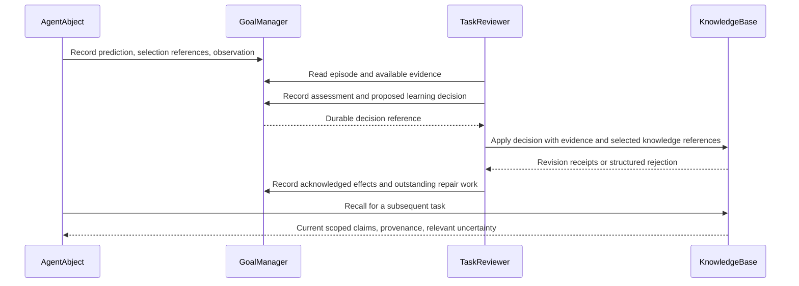

# Connect predictions, assessments, and world-model revisions

Status: implemented in the working tree. Deterministic validation and operational details are recorded in [LEARNING_LOOP_IMPLEMENTATION_2026-09-09.md](LEARNING_LOOP_IMPLEMENTATION_2026-09-09.md). Live recovery and model-quality evaluation require running the updated application.

## Objective

TaskReviewer should interpret experience and turn justified conclusions into durable changes to the world model. A successful task is not sufficient evidence that the agent's beliefs were correct. A successful review response is not sufficient evidence that its proposed knowledge changes were saved.

The observable outcome is a better subsequent decision: a later agent retrieves the corrected, appropriately scoped claim, understands its evidence and uncertainty, and avoids the mistake or unnecessary work that motivated the correction.

## Findings that shape this plan

- AgentAbject already preserves pre-action predictions, observations, injected claim excerpts, and automatic pattern-application receipts. These are the foundation, not a parallel learning subsystem to replace.
- TaskReviewer assesses predictions and proposes knowledge changes, but they are separate operations without an explicit durable dependency between them.
- The latest review recognized that the project has working test/typecheck scripts. One update succeeded; two archives lacked an `evidence` field and were discarded before reaching KnowledgeBase. The generic limitations retained neither actionable pending items nor a repair path.
- GoalManager acknowledges a partial review without retaining it in `pendingReviews`. This prevents runaway whole-review retries, but currently also abandons unfinished correction work.
- KnowledgeBase has automatic pattern revisions and application receipts. Ordinary factual claims need comparable versioned provenance and explicit supersession, rather than competing prose entries beginning with “CORRECTION.”
- Assessment storage currently acknowledges any existing task/step assessment as a duplicate. A later conflicting interpretation must instead be reported as a conflict or recorded as an explicit revision with its own evidence.

Relevant implementation: `agent-abject.ts`, `task-reviewer.ts`, `goal-manager.ts`, `knowledge-base.ts`, and the native KnowledgeBase implementation. Existing capability Abjects remain the owners of external observations.

## Ownership and message flow

| Abject | Responsibility |
| --- | --- |
| AgentAbject | Capture predictions, observed results, selected knowledge receipts, and declared applications; preserve their task/step identities. |
| GoalManager | Own the durable episode evidence, assessment/decision history, and unfinished learning-work records, including after the original goal finishes. |
| TaskReviewer | Interpret evidence; connect it to claims; propose corrections, confirmations, scope changes, pattern feedback, and candidate discoveries; resolve targeted repair work. |
| KnowledgeBase | Own knowledge identity, automatic revisions, revision history, supersession/dispute relationships, retrieval behavior, and durable mutation receipts. |

All transitions are messages through the bus. Storage is accessed by its owning Abject. There is no new learning coordinator and no direct database repair from agents.

The diagram describes an application path. Some interpretations justify retaining uncertainty or making no knowledge change; those dispositions are recorded too.

## 1. Give learning an explicit, durable identity

Introduce a versioned learning-decision contract shared by individual actions and completion batches. Suggested fields:

- Runtime-assigned decision and operation identities, with goal/task/step context.
- References to predictions, observations, owner-provided verification results, and assessments. An observation without a stated prediction may still correct a factual claim; it must not be presented as a successful prediction.
- Affected knowledge selection references and the particular claim being evaluated. Support several entries expressing the same belief and several observations bearing on one claim.
- Interpretation: supported, contradicted, or unresolved; explanation, applicability scope, competing explanations, and limitations.
- Disposition: confirm, revise, narrow scope, supersede, dispute, record pattern feedback, create a scoped claim or candidate pattern, or make no change with a reason. Discovery does not require a pre-existing knowledge entry.
- Proposed effects, receiver acknowledgments, and outstanding repairs.

Models supply meaning: the claim, interpretation, scope, and proposed change. Runtime/receiver code supplies IDs, timestamps, revisions, transport envelopes, and evidence links already established by context. Do not require a model to repeat the same evidence paragraph on each archive in a correction bundle.

Extend selection receipts to factual entries while retaining the existing pattern protocol. Preserve the version actually seen, not a guessed current version. Legacy entries remain readable; missing historical references are explicitly unknown. Do not require a migration that decomposes every prose entry into atomic claims.

Make assessment replay truthful: identical submissions return the existing receipt; conflicting submissions return the existing assessment and a structured conflict. Allow explicit assessment revision when additional evidence changes the interpretation, preserving the earlier assessment and its downstream links.

## 2. Make TaskReviewer connect interpretation to changes

Restructure the review dossier and actions around episodes and affected claims, not independent lists of assessments and edits. Include relevant predictions, original shown claims, current claims, complete-evidence references, and owner-reported background checks.

For a relevant discrepancy, the reviewer should establish:

1. What was predicted or believed, and in what scope?
2. What did the world actually reveal?
3. Does that support, contradict, or leave the claim uncertain?
4. What knowledge disposition follows, and why?

These are reasoning prompts, not mandatory boilerplate on every trivial read. Operation success, output delivery, domain success, and semantic agreement remain distinct. A truncated preview does not establish that a retained full result is unavailable. A transient failure does not justify a permanent claim that a capability is absent.

Use one compact response for a modest review, including assessments and dependent knowledge decisions. Request extra evidence only where it affects interpretation. No-change and unresolved decisions are valid; never force a new lesson or archive merely to finish.

Apply the same contract to pattern learning: retain declared application provenance, assess usefulness separately from use, record counterexamples, narrow conditions where appropriate, and propose new candidate patterns when observations reveal a reusable explanation. Mere injection is not evidence of use, and a single success is not proof of general usefulness.

## 3. Make knowledge revisions acknowledged and retrievable

Add a receiver-owned knowledge-decision operation using opaque selected-version references. KnowledgeBase validates ownership, evidence-reference integrity, operation identity, and revision compatibility; TaskReviewer supplies semantic judgment. The contract must distinguish mechanical rejection from uncertainty about the claim.

KnowledgeBase should:

- Assign revision numbers automatically and retain the rationale and evidence links for each change.
- Preserve unaffected content when revising one claim in a larger entry.
- Return the same durable receipt after an acknowledgment is lost and an operation is retried.
- Return a version conflict instead of overwriting a concurrent correction. TaskReviewer rereads and decides whether further change is still needed.
- Represent supersession explicitly, including the replacement entry and applicable scope. Publish the corrected entry before retiring duplicates, recording each effect so interruption can resume safely. Never acknowledge an unsaved revision.
- Make default recall/weave favor the current applicable claim and exclude superseded claims for that scope. Historical inspection remains available. Accepted disputes remain visible with evidence and uncertainty instead of silently turning into confident facts.
- Preserve user-authored-entry protections. A supported dispute about a protected entry is visible; it does not authorize an overwrite.

Do not treat raw model disagreement or an invalid proposed edit as a confirmed dispute. Only receiver-accepted knowledge state changes affect retrieval.

Implement matching behavior in TypeScript and native/WASM KnowledgeBase, including persistence, restart, and SharedState synchronization. A stale peer update must not resurrect a superseded claim or erase a newer receipt.

## 4. Preserve and repair unfinished learning

Persist proposed items before applying mutation validation, with the original payload, target identity where available, parent decision/evidence references, and any validation errors. Invalid batch members must not disappear into generic strings.

Track each effect as proposed, applied, needs repair, waiting for evidence, blocked by ownership/conflict, or explicitly abandoned with a reason. These are learning-work states, not gates on completion of the user's original task.

Separate “the review turn finished” from “all justified changes were acknowledged.” GoalManager keeps unfinished decision records after review acknowledgment; TaskReviewer consumes them through a dedicated message query on startup and during its existing bounded work cycle.

Repair policy:

- Fill missing mechanical context deterministically when an enclosing decision unambiguously supplies it. Never invent an evidence association.
- Retry transient delivery failures with the same operation ID, bounded backoff, and the existing learning budget.
- For missing semantic content or a revision conflict, permit one focused model repair using only the affected decision and relevant evidence. Further work requires new evidence, a meaningful state change, or explicit resumption; do not repeatedly submit an unchanged invalid message.
- Preserve unresolved items with their next required condition when budgets are exhausted or cancellation occurs. Do not re-run the completed task or whole retrospective.
- Retain the evidence needed by unfinished decisions even if the original task transcript is released. After restart, recover accepted receipts before attempting remaining effects.

Generate completion summaries from receiver acknowledgments. “Proposed archive” and “archived” must remain different facts. Display pending item IDs, targets, and reasons so partial learning is inspectable and repairable.

## 5. Measure whether later behavior improves

Add an end-to-end regression reproducing the exact failure:

1. Seed two active claims that the repository has no tests, plus a partially corrected duplicate.
2. Record successful owner verification on the current project inputs, and a relevant prediction/assessment where available.
3. Submit a correction bundle whose archive items omit redundant per-item evidence.
4. Verify inheritance from the explicit parent decision where valid. Also test an ambiguous omission: it must remain pending with its target and rejection details.
5. Interrupt between accepted update and archive, lose an acknowledgment, and restart.
6. Resume only unfinished effects; verify no duplicate revision or usefulness credit.
7. Start a new agent task. Its normal recall must expose the corrected claim and exclude the superseded claims in scope.
8. Verify current project evidence is used rather than the obsolete fallback advice.

Additional regression cases: unrelated project/environment scopes; supported predictions; expected rejection; output-preview versus actual-result distinctions; missing predictions; uncertainty and contradictory evidence; late assessment revision; concurrent knowledge changes; user-authored protection; cancellation during lookup; native/TypeScript parity; and stale peer synchronization.

Use scripted agents and bus messages for deterministic transport, recovery, and retrieval tests. Evaluate actual semantic judgment separately with a small labeled corpus and a live Abject run; successful writes alone do not demonstrate good learning.

Track: justified corrections acknowledged, stale claims retrieved after correction, incorrectly changed claims, unresolved decisions and their age, knowledge-update conflicts, model calls/tokens for review and repair, and repeated avoidable work in later tasks. Report uncertainty rather than optimizing the number of entries written or maximizing “supported” verdicts.

## Implementation order and acceptance

1. **Recoverability first:** retain rejected items, unify individual/batch contracts, bind shared evidence, and add the durable targeted-repair path. Reproduce the two dropped archive requests. Recover existing partial proposals from persisted review responses where available, preserving their original evidence; use the repaired reviewer/KnowledgeBase message path to retire the known stale entries. Do not reconstruct unavailable historical evidence or edit the database directly.
2. **Connected learning:** decision references linking prediction/observation/assessment to proposed knowledge effects; automatic factual selection receipts; truthful assessment replay and revision.
3. **Effective world-model change:** acknowledged knowledge revisions, supersession/dispute retrieval behavior, concurrent/restart/peer safeguards, and TypeScript/WASM parity.
4. **Learning-quality evaluation:** scoped fact correction, pattern feedback and candidate discovery, negative cases, subsequent-task behavior, and measured live-run costs.

Implement these as vertical slices with bus-driven tests, preserving backward compatibility for existing records and calls. No commits or deployment are implied by this plan.

The acceptance criterion is not “the reviewer returned done.” It is: the evidence-supported decision is durably linked to its observed episode; each proposed effect is acknowledged or remains actionable; and subsequent retrieval reflects accepted changes without losing historical provenance or uncertainty.
