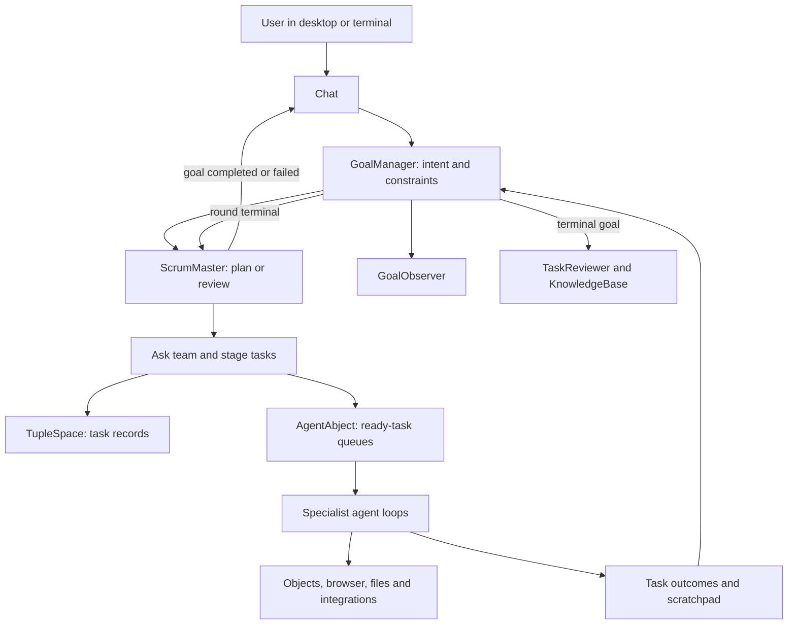

**Abjects: project and agent-system analysis**

Review date: September 6, 2026. Package version: 0.9.13. Git HEAD: `4489f50`.

This report describes the current working tree, including pre-existing uncommitted changes. It is based on repository documentation, implementation tracing, a TypeScript check, the existing test files, and a harmless local sandbox probe. It does not claim a live, model-driven end-to-end evaluation or a complete security audit. No application code was changed for this review.

**1. Overall assessment**

Abjects is a programmable desktop and distributed object runtime with an integrated AI execution system. Its central idea is that software components should expose themselves as addressable objects: discoverable, inspectable, callable through messages, and capable of being created or modified while the system runs.

The agent system builds on that foundation. Agents are specialized objects using a shared execution service; their actions can invoke other objects, edit live applications, work on external projects, operate a browser, or use installed integrations. A planner turns user goals into successive rounds of tasks and reviews the results between rounds.

The strongest parts are the uniform message interface, separation of specialist behavior from execution mechanics, live capability discovery, and explicit handling of context and intermediate results. These mechanisms are implemented, rather than existing only in design documents.

The largest weaknesses are at boundaries where a local result becomes a system-wide guarantee: JavaScript containment, authoritative task completion, declared task outputs, and recovery across process or peer failures. In particular, the current code can publish a successful task before its specialist rejects that success as unverified. That undermines otherwise useful verification machinery.

My assessment is a substantial, actively developed platform with thoughtful agent mechanics and several important correctness gaps. The next improvement should be making its existing guarantees consistent and testable before adding more agent roles.

Sources: [README](../README.md), [package manifest](../package.json), [AgentAbject](../src/objects/agent-abject.ts), [ScrumMaster](../src/objects/scrum-master.ts).

**2. What the project contains**

| Layer | Responsibility | Main implementation |
|---|---|---|
| Object foundation | Identity, manifests, interfaces, messages, lifecycle, contracts, dependency discovery | `src/core/` |
| Runtime | Mailboxes, routing, object placement, workers, supervision | `src/runtime/` |
| Built-in objects | Agents, registries, storage, permissions, workspaces, applications and UI services | `src/objects/` |
| Model integration | Provider adapters, streaming, model capabilities and CLI-backed integrations | `src/llm/` |
| Protocol adaptation | Negotiated agreements, generated translators and connection health | `src/protocol/` |
| Peer networking | Signaling, WebRTC transport, encrypted sessions and remote routing | `src/network/` |
| Generated-code execution | JavaScript execution helpers and a separate WASM implementation | `src/core/sandbox.ts`, `src/sandbox/` |
| User interfaces | Canvas compositor, widgets, browser client, terminal client and Electron packaging | `src/ui/`, `client/`, `cli/`, `electron/` |
| Backend and workers | Startup, WebSocket gateways, persistent storage, pool and dedicated workers | `server/`, `workers/` |
| Native extensions | WASM ABI, C++ SDK, build/install tools and native modules | `sdk/`, `native/`, `scripts/` |

The main implementation is TypeScript. The backend runs on Node, with a thin browser client rendering the desktop through Canvas and forwarding user input. The terminal client, `commune`, connects to the same backend and presents chats, goal progress and permission prompts. Electron packages the desktop experience.

The standard development commands are `pnpm awaken` for the backend, `pnpm scry` for the browser client, and `pnpm commune` for the terminal. `pnpm whisper` runs a signaling server when needed. Those are repository scripts, not commands executed during this review.

**3. The object model and actual concurrency**

An Abject has an ID, a manifest, declared methods and capabilities, message handlers, and lifecycle state. A caller sends a request to an object ID and method; correlated replies resolve promises. Events notify subscribers without requiring a conventional return value.

The Registry supports discovery. The Factory creates objects. Workspace registries provide scoped views of local, shared and system objects. These services are themselves message-addressable Abjects, although the implementation still has privileged host code and infrastructure beneath them.

Two introspection methods matter:

- `describe` exposes structured information derived from the manifest.
- `ask` provides natural-language guidance, normally through an LLM using the object's own description and source-aware guidance. Busy objects can return a quick manifest-derived answer.

Ordinary object requests do not inherently call a model. LLM calls happen when a behavior explicitly asks for one: agent reasoning, natural-language questions, code generation or protocol adaptation.

One important correction to the prose documentation: asynchronous handlers can overlap. The mailbox loop calls `handleMessage(msg)` without awaiting it. Messages are dequeued in order, but that is not a guarantee that one handler completes before the next begins. The per-task maps and keyed mutation locks are therefore essential for correctness.

The backend defaults to `min(8, max(1, CPU count - 1))` pool workers. `ABJECTS_WORKER_COUNT` overrides that, including zero to disable workers. Placement hashes object IDs, and pool workers have direct communication channels. Dedicated P2P and UI worker entry points also exist. Worker threads distribute execution, but they do not by themselves establish a hostile-code security boundary.

Sources: [Abject message processing](../src/core/abject.ts#L756), [backend worker setup](../server/index.ts#L176), [worker pool](../src/runtime/worker-pool.ts), [worker documentation](../workers/README.md).

**4. The agent roster and what each role does**

| Component | Actual role |
|---|---|
| Chat | User-facing interpreter. Expresses work as a goal and presents progress and results. Registered with `canExecute: false`, so it is not a normal task worker. |
| GoalManager | Owns goal records, task state, scratchpad data, progress, pause/resume, user interjections and completion events. |
| ScrumMaster | Plans and reviews rounds, asks agents about their suitability, stages dependencies, dispatches work and decides whether to continue or finish. |
| AgentAbject | Shared execution service. Runs agent loops, keeps conversations, parses actions, manages task slots and reports outcomes. |
| ObjectCreator | Creates, investigates and modifies objects inside Abjects. Learns dependencies, edits source, validates calls, deploys changes and exercises the resulting object. |
| ExternalCreator | Works on host files in registered external projects. Reads and edits files, runs shell commands, compares checks to a baseline and records a factual handoff. |
| ObjectAgent | Uses existing objects to carry out tasks. Provides general object interaction without taking ownership of source authoring. |
| WebAgent | Carries out browser tasks using the browser capability and related web operations. |
| SkillAgent | Executes installed skills and MCP integrations. Its advertised capabilities change when enabled skills change. |
| AgentCreator | Advisory object for autonomous-object design. Its executable creation paths return an advisory-only error; ObjectCreator does the implementation work. |
| TaskReviewer | Reviews finished work to retain useful knowledge and reusable procedures. It is a learning mechanism, not a pre-completion acceptance gate. |
| GoalObserver | Independent inactivity watchdog for goals. |
| Scheduler / TriggerManager | Time-driven and event-driven automation. These can invoke work without an active chat interaction. |

AgentAbject is shared within a workspace: the workspace bootstrap creates an instance for each workspace. It is not one global agent brain for every workspace. Most execution infrastructure starts for inactive workspaces too, while a separate list of UI-related objects is deferred until activation. ObjectCreator is currently in that deferred list, which means background workspace availability deserves explicit testing.

Sources: [workspace object lists](../src/objects/workspace-manager.ts#L52), [AgentCreator advisory behavior](../src/objects/agent-creator.ts), [Chat](../src/objects/chat.ts), [specialist implementations](../src/objects/).

**5. How a user request becomes completed work**



The normal path is:

1. Chat captures what the user wants in a goal description, including ordering and constraints. The prompt tells Chat to leave task decomposition to ScrumMaster.
2. ScrumMaster examines the goal, previous results and available agents. It can poll agents through the Ask Protocol for an approach or a refusal to participate.
3. It stages tasks with an assigned agent, optional named ID, dependencies, and scratchpad `produces` / `consumes` declarations.
4. Dispatch validates the data contracts, adds inferred dependencies, creates task tuples, records blocked tasks, and queues ready tasks.
5. AgentAbject starts tasks when the selected agent has capacity. Each specialist initializes its own task context and enters the shared loop.
6. Results and progress reach GoalManager. Completing a dependency releases waiting tasks; failure cascades to tasks that depend on it.
7. When all tasks in the current round are terminal, ScrumMaster reviews what happened and either plans another round, finishes the goal, fails it, or requests clarification.

There is also a conditional `quick_dispatch` path for one clearly assignable task. It avoids the full team-polling and review sequence on success; a failure returns the goal to normal planning.

Round boundaries are intentional replanning checkpoints. The system does not execute one immutable plan from beginning to end. Failed tasks become evidence for the next plan. Although old `maxAttempts: 3` metadata remains, the current `failTask` implementation terminates that task and leaves corrective scheduling to ScrumMaster.

The advertised parallelism requires care: omitting `dependsOn` adds a dependency on the previous staged task. Independent tasks need `dependsOn: []`. Declaring only independent outputs does not remove that sequential default.

Sources: [Chat goal dispatch](../src/objects/chat.ts#L1338), [ScrumMaster task staging](../src/objects/scrum-master.ts#L1320), [dispatch and dependency release](../src/objects/scrum-master.ts#L1918), [task failure policy](../src/objects/goal-manager.ts#L1922).

**6. What happens inside an agent loop**

The specialists generally extend `Abject` and register with AgentAbject. They do not each implement a separate model-driving engine. Their key callbacks are `agentObserve` and `agentAct`.

The shared cycle is **observe → think → act → observe**:

- Observation describes the current task state and can include images and a model-tier hint.
- Thinking sends the conversation to the LLM service, streams the answer, and parses a JSON action envelope.
- Acting dispatches the chosen operation to the specialist or handles a shared runtime operation.
- A terminal action, normally `done` or `fail`, ends the loop. Intermediate replies can surface progress without ending it.

The runtime handles malformed JSON, empty model replies, truncated output, terminal aliases and action batching. Batches drain sequentially without another model call; a failed action discards the remaining batch. These mechanisms reduce avoidable round trips and give imperfect model output a controlled recovery path.

Default configuration is 25 steps and three concurrent tasks per registered agent. Specialists override step and timeout settings: ScrumMaster normally uses 12 steps, ExternalCreator 50, and ObjectCreator's task startup allows 45. Timeouts are used at several request and activity layers; they should not be read as one uniform end-to-end deadline.

The queue skips paused goals, prefers goals that do not already occupy an active slot, and then prefers higher-priority tasks. Priority is based on the number of transitive dependents, a useful downstream-work heuristic rather than a duration-based critical-path calculation.

Loop protection includes repeated-action detection, bounded parse recovery and up to two ten-step extensions when recent actions show varied successful progress. After exhaustion, a final model call tries to salvage a useful result. That salvage result still needs authoritative verification before it should count as completed work.

Pause and cancellation are checked between loop phases. They do not establish that an already executing browser action, subprocess or external side effect has been interrupted or reversed.

Sources: [configuration and queue selection](../src/objects/agent-abject.ts#L492), [state machine](../src/objects/agent-abject.ts#L2427), [step extensions](../src/objects/agent-abject.ts#L3015), [thinking and parsing](../src/objects/agent-abject.ts#L3325).

**7. Context, model use and learning**

The runtime separates stable instructions from task-specific context so providers that support prompt caching can reuse a consistent prefix. It injects relevant knowledge, profile facts, goal context and explicitly consumed scratchpad values.

Large outputs normally become searchable payload handles above 8,000 characters. Agents can use `read_chunk` with an offset, grep or outline, or process a held payload through `submit_job` and return a small result. This is especially useful for pages, structured data and long command output: the model need not read every byte to operate on it.

Conversation trimming uses a 180,000-character budget and a 200-message guard. Compression can summarize older context; deterministic truncation is the final fallback. Held payloads and conversation history are different things: preserving a payload does not mean all past reasoning survives compression intact.

The LLM object centralizes providers, tier routing, streaming, compression, call records and usage accounting. Agent decision calls use at least the balanced reasoning tier, with code/smart routing and vision-aware adjustments. The repository contains cloud API, local-model and CLI-backed adapters. Their existence was verified in source; their remote availability and current vendor model offerings were not tested here.

KnowledgeBase supplies persistent lexical retrieval through SQLite FTS5/BM25 in the TypeScript implementation; a native WASM implementation also exists. TaskReviewer examines finished goal transcripts, credits knowledge that helped, extracts durable lessons and can author reusable skills for user review. Its current limits include 24 reviews per day, six tasks per goal review, and a 40,000-character combined transcript budget. Standalone tasks are sampled every four completions, with failures counting double.

Actions may include an `expect` prediction. The runtime records the outcome and marks mechanical failures; TaskReviewer can examine semantic discrepancies afterward. This gives the learning loop more evidence than a final success flag alone.

SkillAgent still appends the full bodies of enabled skills to its prompt. Large skill collections can therefore consume substantial context even when most skills are irrelevant to the current task.

Sources: [context assembly](../src/objects/agent-abject.ts#L3551), [conversation trimming](../src/objects/agent-abject.ts#L4292), [LLM service](../src/objects/llm-object.ts), [KnowledgeBase](../src/objects/knowledge-base.ts), [reviewer limits](../src/objects/task-reviewer.ts#L49), [skill instruction loading](../src/objects/skill-agent.ts#L1057).

**8. Creation, verification and deployment**

ObjectCreator follows a source-authoring workflow: discover the target and dependencies, ask how they work, stage source changes, validate them, deploy, and exercise the live object. Deployment checks syntax and known calls against live manifests. Semantic model review is advisory. Source changes can be hot-swapped and persisted; undeployed drafts can be preserved in the goal scratchpad for later work.

Its final gate checks that authored source matches the last deployed source and that the object has been exercised after deployment. That is useful evidence, but one exercised behavior is not comprehensive acceptance testing, and taking a screenshot is not universally required by the gate.

ExternalCreator selects a registered project, applies project instructions and permissions, captures a check baseline, and optionally creates a worktree. Worktree isolation is opt-in and can fall back to working in place if setup fails. File edits use exact matching, track before/after images, and can run the fast check when an edit set closes. Verification compares failure signatures to the baseline and records attribution and uncertainty.

Its final gate checks whether modified files have sufficiently current verification. Projects without configured check commands can complete with an explicit statement that automatic verification did not run. The handoff is assembled from recorded files, commands, checks and checkpoints, making it less dependent on the model accurately remembering its own work.

These are good specialist mechanisms. Their late position in the completion sequence is the major flaw described below.

Sources: [ObjectCreator deployment and completion](../src/objects/object-creator.ts#L3728), [ExternalCreator verification gate](../src/objects/external-creator.ts#L1385), [ExternalCreator finalization](../src/objects/external-creator.ts#L1748).

**9. Distribution, persistence and repair**

Workspaces govern discovery and access. The implementation distinguishes `local`, `shared` and `public` modes, with peer allowlists, catalog curation, and object-level shareability rules. Remote discovery is consequently more than exposing every local object to a connected peer.

Peer transport implements cryptographic identities, authenticated key exchange and AES-GCM application-layer encryption over WebRTC. Signaling establishes connectivity; object traffic follows the peer transport. This describes the implemented protocol, not a cryptographic audit result.

SharedState uses last-writer-wins registers, timestamps and peer-ID tie breaking. Goal metadata, scratchpad keys and progress can be synchronized. GoalManager records the creator peer for single-owner execution, and remote task progress is kept separately rather than copied into local executable tuples. TupleSpace itself has optimistic claims and a five-minute stale-claim interval. These are coordination mechanisms, not proof of exactly-once execution under partition or owner failure.

Goal records have a persistent index and reload through SharedState. AbjectStore persists generated source and object data, including bounded source-version history. The in-flight agent conversations, queues and ScrumMaster dependency maps are held in memory. Persisted goals should therefore not be confused with complete checkpoint-and-resume of every running action. Transparent owner failover and task resumption need dedicated integration evidence.

Repair operates at three different levels: HealthMonitor and Supervisor restart supervised objects; Negotiator and ProxyGenerator adapt incompatible protocols; ScrumMaster replans after task failures. These recover different kinds of failure. Neither restarting an object nor generating a new proxy guarantees that an external operation was completed correctly.

GoalObserver warns after 20 minutes without a goal update and auto-fails after 30 minutes by default. That detects silence, not lack of meaningful progress: repeated activity updates can keep a looping goal alive.

Sources: [peer transport](../src/network/peer-transport.ts), [SharedState](../src/objects/capabilities/shared-state.ts), [TupleSpace](../src/objects/tuple-space.ts), [goal persistence](../src/objects/goal-manager.ts#L870), [supervisor](../src/runtime/supervisor.ts), [GoalObserver](../src/objects/goal-observer.ts).

**10. Findings that deserve attention**

**A. High priority: the JavaScript sandbox does not enforce its stated host-isolation boundary. Confirmed by a local probe.**

The shared sandbox injects host constructors such as `Object` into a Node `vm` context. Its regular-expression filter rejects some obvious dangerous expressions, but the following harmless expression passes `validateCode` and returns `"object"` from `runSandboxed`:

```js
return Object.constructor("return typeof process")()
```

The probe only checked a type; it did not inspect environment variables, read files or start processes. It demonstrates access to the host `process` global despite the documented restriction. JobManager and ScriptableAbject both use this shared sandbox library. The claim that all untrusted code is contained by WASM does not describe these JavaScript paths.

The boundary needs isolated execution with explicitly mediated host capabilities. More regex exclusions would not address the underlying exposure of host constructors. Source: [sandbox built-ins and execution](../src/core/sandbox.ts#L19).

**B. High priority: final verification can reject a task after the planner has already been told it succeeded. Confirmed by implementation order.**

`AgentAbject.finalizeTask` calls `GoalManager.completeTask` from the loop's terminal state and then emits `taskResult`. ObjectCreator and ExternalCreator apply their specialist gates after receiving that result. A gate failure changes the returned specialist result or produces a warning, but these paths do not undo the completed tuple.

For queued tasks, the dispatcher sends `executeTask` without awaiting the specialist's final response. Thus a producer can unblock dependent tasks before its verification rejects completion. ExternalCreator's own comment explicitly acknowledges this ordering.

The system needs one authoritative terminal transition after specialist acceptance, output validation and result-schema validation. Direct callers and queued tasks should receive the same outcome. Sources: [runtime finalization](../src/objects/agent-abject.ts#L2071), [queue dispatch](../src/objects/agent-abject.ts#L2391), [ExternalCreator late gate](../src/objects/external-creator.ts#L1775), [ObjectCreator late gate](../src/objects/object-creator.ts#L3755).

**C. High priority: JavaScript capability enforcement is permissive on defaults and cache misses. Confirmed in source.**

CapabilityInterceptor defaults to `warn`, and even `enforce` passes the first request from an unknown sender or to an uncached target while metadata loads. It also exempts built-in system objects, certain open methods, and targets without provided capabilities. Its decision compares manifest declarations, which is different from checking an independently issued grant.

PermissionBroker and individual capability objects provide additional controls, so this does not mean every operation is unrestricted. It does mean this interceptor cannot currently be described as a fail-closed authorization boundary. Source: [CapabilityInterceptor](../src/runtime/capability-interceptor.ts#L1).

**D. Medium priority: task data contracts and result schemas do not enforce successful delivery. Confirmed in source.**

Dispatch validates that consumed scratchpad keys have a producer or already exist. Completion only warns when declared `produces` keys are missing. The generic `tasks/<id>/result` mirror preserves a result, but does not satisfy a downstream consumer expecting a different named key. Similarly, response-schema failures are logged and attached to the result without changing success.

Require declared outputs and schema validity before releasing dependents where those declarations are used as contracts. Sources: [missing-output warning](../src/objects/goal-manager.ts#L1840), [schema validation](../src/objects/agent-abject.ts#L2083).

**E. Medium priority: dependency scheduling has two implementation limits. Confirmed in source.**

Omitted dependencies default to a sequential chain. Also, dispatch assigns downstream-work priority to immediately ready tasks, but `pendingDeps` does not retain that priority and `unblockDependents` does not forward it. Tasks released later in a deep graph therefore lose that scheduling advantage. Sources: [sequential default](../src/objects/scrum-master.ts#L1384), [dispatch and release](../src/objects/scrum-master.ts#L1978).

**F. Medium priority: current checks are not clean and routine validation is not wired into the visible release workflow.**

The TypeScript check reports eight optional-property errors in `external-project-browser.ts`. One of 13 test-file processes fails; its isolated run shows two failing catalog-sync assertions. The tests expect a fresh joiner to receive a catalog, while the implementation rejects the fixture's peer and returns empty deltas. Determine whether the fixture needs authorized-peer setup or the access check is incorrect; this is not evidence of a catalog data leak.

The package has no standard `test` or `typecheck` script. The visible GitHub workflow builds releases from tags without an explicit test or TypeScript-check step. Sources: [failing browser file](../src/objects/external-project-browser.ts#L482), [catalog tests](../src/objects/workspace-share-registry.p1p3.test.ts#L251), [release workflow](../.github/workflows/release.yml).

**G. Maintainability: documentation and implementation have drifted.**

Examples include sequential-handler descriptions despite overlapping async handlers, WASM-only containment language despite JavaScript execution, and old agent-review statements that predate the current gates and context settings. The current agent runtime alone is about 4,900 lines; ObjectCreator is about 4,050 lines, with prompts, execution, validation and lifecycle code combined. This makes ordering defects harder to see and isolated regression tests harder to write.

The valuable extraction points are mechanisms with independent rules: task finalization, queue policy, prompt assembly, output validation and specialist acceptance. The existing `task-graph.ts` and exported queue-selection helper already follow that direction.

**11. Validation performed and its limits**

| Check | Result |
|---|---|
| `pnpm exec tsc --noEmit` under Node 24.20.0 | Failed with eight `TS18048` errors in `external-project-browser.ts`, concerning possibly undefined `sharedPaths` and `protectedPaths` at lines 482, 483, 618, 620 and 623. |
| Existing `*.test.ts` files under objects, network, LLM and protocol directories | 13 test-file processes: 12 passed, one failed. These are file-process counts, not individual assertion counts. |
| Isolated workspace-share registry test | Eight tests: six passed, two failed. Both failures involve initial catalog synchronization returning empty results. |
| Shared JavaScript sandbox probe | Filter accepted the expression and execution reported the host `process` global as an object. |
| Live model-driven goal, browser and multi-peer recovery exercises | Not run. Provider quality, actual spend, end-to-end latency and distributed recovery remain unmeasured. |

The suite command was:

```sh
node --import tsx --test src/objects/*.test.ts src/network/*.test.ts src/llm/*.test.ts src/protocol/*.test.ts
```

Raw test output is retained for this session at `/tmp/abjects-analysis-tests.log` and `/tmp/abjects-analysis-share-test.log`. Type checking inspected the existing working tree; the errors have not been attributed to a particular commit or author.

**12. Suggested engineering sequence**

1. Establish a real boundary for generated JavaScript and verify it independently of ordinary functionality tests.
2. Move specialist acceptance ahead of the authoritative task-completion event. Test a rejected `done` with a waiting dependent and verify that the dependent never starts.
3. Enforce declared outputs and requested result schemas, with explicit failure reasons that ScrumMaster can use to replan.
4. Resolve the TypeScript errors and catalog-test mismatch, then make typecheck and tests standard package and CI commands.
5. Exercise complete workflows: a one-task goal; parallel producers and a consumer; a failed producer; pause/cancel during a long action; owner restart; peer reconnection; and work submitted to an inactive workspace.
6. Preserve priority when dependencies unblock, clarify the parallel-task declaration, and load skill instructions on demand as skill collections grow.
7. Measure planning overhead, model calls, cost per completed goal, verification rejection rate and task recovery. Use those measurements to tune concurrency and model tiers.

The project's central design is already represented in working code: objects expose capabilities, specialists use them, and a shared planner coordinates longer work. The decisive next step is to make containment, completion and recovery mean the same thing across every path through the system.
